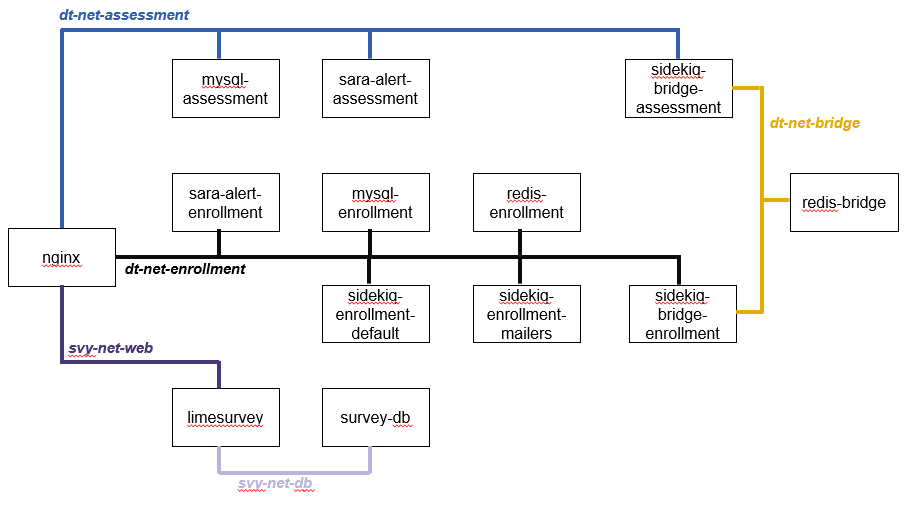

Sara Alert™ is an open source tool built to allow public health officials to monitor potentially exposed individuals (“monitorees”, e.g., contacts of cases or travelers from affected areas) over time for symptoms by enrolling them in the system. During enrollment, the potentially exposed individual indicates their preferred method for daily contact. The enrolled monitoree receives a daily reminder from Sara Alert to enter temperature and any symptoms. If any symptoms are reported, the public health official receives an alert in order to coordinate care. If the monitoree fails to report, the public health official can follow up after a pre-defined period. Public health officials have access to reports and aggregated data based on their level of access.

Sara Alert was built in response to the COVID-19 outbreak, but was designed to be customizable such that it can be deployed to support future outbreaks.

## Installing and Running

Sara Alert is a Ruby on Rails application that uses the MySQL database for data storage and Redis for message processing.

### Prerequisites

To work with the application, you will need to install some prerequisites:

* [Ruby](https://www.ruby-lang.org/)
* [Bundler](https://bundler.io/)
* [MySQL](https://www.mysql.com/)
* [Redis](https://redis.io) (installation instructions [below](#redis))
* [Yarn](https://yarnpkg.com/)

### Development Installation

#### Application

Ensure that [Git LFS](https://git-lfs.github.com/) is installed and initialized.

Clone the project: `git clone https://github.com/SaraAlert/SaraAlert.git`

Ensure mime type information is present on your machine (`brew install shared-mime-info`, `apt install shared-mime-info`, etc.)

Run the following commands from the project's root directory to pull in both frontend and backend dependencies:

* `bundle install`
* `yarn install`

#### Database

Sara Alert targets compatibility with MySQL 5.7.

**macOS Installation Instructions:**

**Migrating from a newer verison down to MySQL 5.7:**
Before installing MySQL, if newer versions (i.e. version 8 of MySQL) have previously been installed and initialized in the newer format, these new-format databases will be incompatible with the older 5.7 version. A simple way to install 5.7 after newer versions is to delete the MySQL data directory and let the 5.7 version recreate it in the correct format. Take care to **back up** existing databases before executing the following command, as it will delete them:

```sh
brew services stop mysql # stop current mysql version
rm -rf /usr/local/var/mysql # remove the macOS mysql data directory and any existing databases
brew uninstall mysql # remove current mysql version
```

If Sara Alert had already been installed with a newer version of MySQL, navigate to the project directory and uninstall the `mysql2` gem. It needs to build the correct native extensions for MySQL 5.7.

```sh
gem uninstall mysql2 # uninstall mysql2
```

Newer versions of MySQL also start with incompatible options for version 5.7, so if you had a newer version installed edit `/usr/local/etc/my.cnf` to remove the line `'mysqlx-bind-address=127.0.0.1'`.

**Installation:**

Now, install `mysql@5.7` using [`homebrew`](https://brew.sh):

```sh
brew install mysql@5.7
brew link mysql@5.7 --force
brew services start mysql@5.7
```

```sh
# Please update this command with the appropriate <MINOR_VERSION> installed from homebrew.
bundle config --local build.mysql2 "--with-mysql-config=/usr/local/Cellar/mysql@5.7/5.7.<MINOR_VERSION>/bin/mysql_config --with-ldflags=-L/usr/local/opt/openssl/lib --with-cppflags=-I/usr/local/opt/openssl/include"
bundle install
```

**Database Initialization:**

Run the following commands from the root of the project directory to initialize the database (note: make sure you have a MySQL database and Redis running):

* `mysql -u root -e "CREATE USER 'disease_trakker'@'localhost'; GRANT ALL PRIVILEGES ON *.* TO 'disease_trakker'@'localhost';"` optional for local development only, not for docker containers
* `rails db:create`
* `rails db:schema:load`
* `bundle exec rake admin:import_or_update_jurisdictions`
* `bundle exec rake demo:setup demo:populate` optional
#### ActiveJob + Sidkiq + Redis

ActiveJob will work with Sidekiq, and Redis to manage the queueing and running of jobs (used to send emails, SMS, and other methods of notification).

##### Redis

Redis will need to be installed and running. To install Redis:

```bash
wget http://download.redis.io/redis-stable.tar.gz
tar xvzf redis-stable.tar.gz
cd redis-stable
make
```

To start Redis:

```
redis-server
```

##### Sidekiq

Sidekiq is the queueing system that ActiveJob interfaces with. Sidekiq should be installed when you ran `bundle install` in the application installation instructions. To start Sidekiq, and make it aware that it is responsible for the mailers queue, execute the following:

```
bundle exec sidekiq -q default -q mailers -q exports
```

##### Jobs

  The following jobs are configured to run continuously:
  * `ConsumeAssessmentsJob`
      - Should always be running in order to be ready to consume assessments at any time.
      - Handles consuming assessments from the assessment container into the enrollment container.
      - Run with `bin/bundle exec rake reports:receive_and_process_reports`

  The following jobs are configured to run periodically:
  * `ClosePatientsJob`
      - Closes (stops active monitoring of) Patients that meet duration/symptomatic conditions criteria
      - Recommend this be run every hour
      - Run with `bin/bundle exec rake subjects:close_patients`
  * `PurgeJob`
      - Purges eligible records
      - Recommend this be run once every week
      - Date/Time which the Job runs needs to match what is set in `config/sara.yml`: `weekly_purge_date`
      - Run with `bin/bundle exec rake admin:purge_job`
  * `SendPurgeWarningsJob`
      - Send warnings to users of upcoming `PurgeJob`
      - Recommend this be run once every week before `PurgeJob`
      - Date/Time which the Job runs needs to match what is set in `confi/sara.yml`: `weekly_purge_warning_date`
      - Run with `bin/bundle exec rake mailers:send_purge_warning`
  * `SendPatientDigestJob`
      - Send reports on recently symptomatic patients to jurisdictions that opt in with `send_digest: true` set in their jurisdiction's configuration in `jurisdictions.yml`
      - Recommend this be run once every hour
      - Run with `bin/bundle exec rake mailers:send_patient_digest`
  * `CacheAnalyticsJob`
      - Caches analytics information for faster retrieval
      - Recommend this be run once every 24 hours
      - Run with `bin/bundle exec rake analytics:cache_current_analytics`
  * `SendAssessmentsJob`
      - Send assessment reminders to monitorees
      - Recommend this be run once every hour
      - Run with `bin/bundle exec rake mailers:send_assessments`
  * `PurgeJwtIdentifiersJob`
      - Purge expired JWT Identifiers that are saved and validated when clients request access to the API.
      - Recommend this be run once every 24 hours
      - Run with `bin/bundle exec rake admin:purge_jwt_identifiers`

NOTE: In any production instance, these jobs should be handled outside of any of the containers (they should be scheduled and launched via crontab by the host).

#### Running

To run Sara Alert, execute: `bundle exec rails s`.

In a development environment, login with username/password credentials created with the [`demo:setup`](https://github.com/SaraAlert/SaraAlert/blob/master/lib/tasks/demo.rake) rake task
or create user accounts with the [`user:`](https://github.com/SaraAlert/SaraAlert/blob/master/lib/tasks/user.rake) rake tasks (some environment variables required).

### Installation (Docker)

#### Getting Started

Ensure [Docker](https://docs.docker.com/get-docker/) and [Docker Compose](https://docs.docker.com/compose/install/) are installed.

This application includes several Dockerfiles and Docker Compose configurations. Let's go over each of them:

* `Dockerfile`: This Dockerfile is essentially the same as the `DevelopmentTest.Dockerfile` but provides support for developers that want to get a development and test environment up and running with a simple `docker build .`
* `DevelopmentTest.Dockerfile`: This Dockerfile is used in the project's Continuous Integration (CI) and allows developers to get started with the full split stack architecture as its the default used in the compose files. It contains the dependencies for running tests.
* `Production.Dockerfile`: This Dockerfile is built for production or staging deployments.
* `Nginx.Dockerfile`: This Dockerfile is built from `DevelopmentTest.Dockerfile` or `Production.Dockerfile` which contains all static assets (i.e. the `public/` folder).
* `docker-compose.yml`: This docker compose file sets up the numerous containers, networks, and volumes required for the split architecture.
* `docker-compose.prod.yml`: The only difference between this file and the normal one is the overwriting of the `DevelopmentTest` image tag with the `latest` tag.

NOTE: The provided docker compose configurations are meant to be examples of production style deployments ONLY. Do not use them verbatim in real production scenarios.

##### Amazon S3 Usage

Amazon S3 is the currently used method for object storage within Sara Alert. Because object storage is integrated into Sara Alert using ActiveStorage, the object storage provider can be swapped out by updating `config/storage.yml` and following [the rails documentation](https://edgeguides.rubyonrails.org/active_storage_overview.html#s3-service-amazon-s3-and-s3-compatible-apis).

Object storage is used by the monitoree exports feature.

##### Basic S3 Setup
1. Create a bucket for exports
2. Create an IAM user with an associated access key
3. Create a new permissions policy with the minimum required permissions for the S3 service of ListBucket, GetObject, DeleteObject, and PutObject and assign it to the user

#### Building

* Create a `certs/` directory in the root of the project

If you are building the image behined a corporate proxy:

* Place your company `.crt` file in it
* `export CERT_PATH=/path/to/crt_from_above.crt`

Building for staging requires the use of the `Production.Dockerfile` and `Nginx.Dockerfile`.

* `docker build -f Production.Dockerfile --tag sara-alert:latest --build-arg cert="$(cat $CERT_PATH)" .`
* `docker build -f Nginx.Dockerfile --tag sara-alert-nginx:latest --build-arg sara_alert_image=sara-alert:latest .`

#### Deploying Staging

Deploying a staging server is done with `docker-compose.yml`, `docker-compose.prod.yml`, and the two images created in the previous section. Make sure the images are on the staging server or they can be pulled from a Docker registry to the staging server.

**Docker Networking**

The `docker-compose.yml` file sets up three networks which route traffic between the containers. The networks are:

* `dt-net-enrollment`: Hosts the applications/services used for enrolling and monitoring.
* `dt-net-assessment`: Hosts the application/services used by monitorees filling out assessments.
* `dt-net-bridge`: Facilitates communication between the two other networks.
* `svy-net-web`: Hosts the survey management software
* `svy-net-db`: Backend network that hosts the database used by the survey management software

This results in a 'split architecture' where multiple instances of the SaraAlert application are running. This approach attempts to reduces the amount of services that have access to the monitoree database.

A key portion of this is the use of Nginx as a reverse proxy server. The configuration (located at `./nginx.conf`) will route traffic from 'untrusted' users submitting assessments to containers running in the `dt-net-assessment` network. Authenticated users, such as enrollers and epidemiologists are routed to components on `dt-net-enrollment`. Those accessing the survey software are routed onto the `svy-net-web` network.

Below is a graphic depicting the services and applications present on each network:


**Sara Alert Environment Variable Setup**

To set up Sara Alert in a staging configuration, generate two environment variable files which correspond with the networks described above:

* `.env-prod-assessment`
* `.env-prod-enrollment`

The content for the first two files can be based off of the `.env-prod-assessment-example` and `.env-prod-enrollment-example` files. It is important to note that `SARA_ALERT_REPORT_MODE` should be set to `false` for the enrollment file and `true` for the assessment file. `SHOW_DEMO_WARNING=true` should be set to warn users against uploading sensitive data to a test or demonstration instance of Sara Alert.

The `SECRET_KEY_BASE` and `MYSQL_PASSWORD` variables should be changed at the very least. These variables should also not be the same between both assessment and enrollment instances of the files.

Sara Alert relies upon several external services that are configured with environment variables:

***Export Environment Variables***

The following environment variables are used to adjust export configurations. They only need to be set on the enrollment instances as those are what handle the exports.
If not set, these variables will default to 10,000 and 500 respectively.

* `EXPORT_INNER_BATCH_SIZE: number of Patient records to be considered at a given time when getting and writing data to files (for memory optimizations)`

To bypass AWS S3 object storage and use local storage for development or test purposes, set `ACTIVE_STORAGE_DRIVER=development`. To use AWS S3, set this environment variable to `amazon`.

Information on changing the Sara Alert storage backend can be found [here](https://edgeguides.rubyonrails.org/active_storage_overview.html#s3-service-amazon-s3-and-s3-compatible-apis). The following environment variables need to be set in the relevant containers, where exports will be created and/or served.
* `ACTIVE_STORAGE_DRIVER=amazon`
* `AWS_S3_ACCESS_KEY_ID=<Access Key ID generated from the AWS console or API that has access to the bucket provided below>`
* `AWS_S3_SECRET_ACCESS_KEY=<Secret belonging to the Access Key ID above>`
* `AWS_S3_BUCKET=<S3 bucket for Sara Alert export upload/download>`
* `AWS_S3_REGION=<S3 region the above S3 bucket exists in>`

***Twilio/Authy Environment Variables***

The following environment variables need to be set on the enrollment instances, which are the instances that will be dispatching the SMS/Voice assessments via Twilio and performing Two-Factor Authentication using Authy. These environment variables can be set in a `config/local_env.yml` file, or via a method provided by the deployment environment.
* `TWILLIO_API_ACCOUNT: <Account number for Twilio Account>`
* `TWILLIO_API_KEY: <API key for Twilio Account>`
* `TWILLIO_SENDING_NUMBER: <Phone number registered to Twilio Account for SMS/Voice>`
* `TWILLIO_STUDIO_FLOW: <Twilio Studio Flow ID for handling SMS/Voice Assessments>`
* `AUTHY_API_KEY: <API key for Authy project>`
* `TWILLIO_MESSAGING_SERVICE_SID=<SID of assigned messaging service>`

**LimeSurvey Environment Variable Setup**

Key-value pairs (*KEY=value*) of environment variables used by the containers that host LimeSurvey and its database are expected in a file, `survey-compose.env`. An example that can be used as a starting point is at `lime-conf.d/survey-compose.env.example`.

Once complete, this file will be moved to the deployment directory described in the following sections.

The principal variables that should be given values are presented in the following table.  See the example file for other optional variables.

|Variable |Example Value |Reqd? |Description|
|---|---|--|---|
LIMESURVEY_DB_USER|root |No |Privileged database user; defaults to root
LIMESURVEY_DB_PASSWORD |Str0ngPwv@l2here |Yes |Password of database root user; must match value in MYSQL_ROOT_PASSWORD in database container configuration
LIMESURVEY_DB_NAME |limesurvey |No |Name of database created by LimeSurvey; defaults to limesurvey
LIMESURVEY_ADMIN_USER| myadminname |Yes\* |Username for the LimeSurvey administrator created when LimeSurvey is first installed. For increased cybersecurity, use something other than admin. \*Required only the first time the container is run. Consider removing this line (and adming password line) after LimeSurvey is setup and working.
LIMESURVEY_ADMIN_PASSWORD |709KTwu*^WHfx | Yes* |Password of the administrator user. This value is set every time the container is restarted! It will override any value set in the GUI. \*Required only the first time the container is run. Consider removing this line (and admin username line) after LimeSurvey is setup and working.
LIMESURVEY_ADMIN_NAME |Lime Administrator |No |Full name of the Administrator; defaults to "Lime Administrator"
LIMESURVEY_ADMIN_EMAIL| name@example.com |No | Email address of Administrator account; defaults to lime@lime.lime. Can be set using the GUI.
MYSQL_ROOT_PASSWORD |Str0ngPwv@l2here |Yes |Password of database root user; must match value in LIMESURVEY_DB_PASSWORD in limesurvey container configuration


**Container Dependencies**

Create a directory into which the deployment configuration files will be copied. Copy both docker compose files and the three environment variable files from the previous section (`.env-prod-assessment`, .`env-prod-enrollment`, and `survey-compose.env`) into this folder. Within this deployment directory, create a subdirectory called `tls` and place your web server private key and certificate (i.e., `.key` and `.crt` files inside. Rename the files to `puma.key` and `puma.crt`. Ensure the `.crt` and `.key` files within the `tls` directory are at least `0x004` permissions so they can be read inside the container.

The Nginx configuration is also staged within the same directory. Copy the `nginx.conf` provided in the root of this repository to *<deployment_dir>*`/tls/nginx.conf`.

Create a directory, `lime-runtime` inside the deployment folder. 

The deployment folder content should look like the following:

>>>
* *deployment_folder*
    * *lime-runtime*
    * *tls*
        * nginx.conf
        * puma.crt
        * puma.key
    * .env-prod-assessment
    * .env-prod-enrollment
    * docker-compose.yml
    * docker-compose.prod.yml
    * survey-compose.yml
>>>

**Deployment**

Before any of the following commands, export the images you're working with. For the staging environment, the tag is assumed to be `latest`. Example for a locally built image (you will likely need to update this to point to your registry!): `export SARA_ALERT_IMAGE=sara-alert` and `export NGINX_IMAGE=sara-alert-nginx`.

* `/usr/local/bin/docker-compose -f docker-compose.yml -f docker-compose.prod.yml pull`
* `/usr/local/bin/docker-compose -f docker-compose.yml -f docker-compose.prod.yml up -d --remove-orphan`
* `/usr/local/bin/docker-compose -f docker-compose.yml -f docker-compose.prod.yml run sara-alert-enrollment bin/bundle exec rake db:create`
* `/usr/local/bin/docker-compose -f docker-compose.yml -f docker-compose.prod.yml run sara-alert-enrollment bin/bundle exec rake db:migrate`
* `/usr/local/bin/docker-compose -f docker-compose.yml -f docker-compose.prod.yml run sara-alert-assessment bin/bundle exec rake db:create`
* `/usr/local/bin/docker-compose -f docker-compose.yml -f docker-compose.prod.yml run sara-alert-assessment bin/bundle exec rake db:migrate`

**Post-deployment Setup**

Before any of the following commands, export the image you're working with. For the staging environment, the tag is assumed to be `latest`. Example for a locally built image (you will likely need to update this to point to your registry!): `export SARA_ALERT_IMAGE=sara-alert`

Load Jurisdictions:

* `/usr/local/bin/docker-compose -f docker-compose.yml -f docker-compose.prod.yml run sara-alert-enrollment bin/bundle exec rake admin:import_or_update_jurisdictions`
* `/usr/local/bin/docker-compose -f docker-compose.yml -f docker-compose.prod.yml run sara-alert-assessment bin/bundle exec rake admin:import_or_update_jurisdictions`

Note: If you need to make live-changes to the jurisdictions loaded on they system, you'll have to update `config/sara/jurisdictions.yml` on the sara-alert-assessment and sara-alert-enrollment containers. The changes made to each of the jurisdictions.yml files **NEED TO BE IDENTICAL**

Setup the demonstration accounts and population if desired:

* `/usr/local/bin/docker-compose -f docker-compose.yml -f docker-compose.prod.yml run -e DISABLE_DATABASE_ENVIRONMENT_CHECK=true sara-alert-enrollment bin/bundle exec rake demo:setup`
* `/usr/local/bin/docker-compose -f docker-compose.yml -f docker-compose.prod.yml run -e DISABLE_DATABASE_ENVIRONMENT_CHECK=true sara-alert-enrollment bin/bundle exec rake demo:populate`

See the instructions in [lime-conf.d/README.md](lime-conf.d/README.md) for performing post-deployment configuration for LimeSurvey.

The applications should be running on port 443 with Nginx proxying traffic between.

## API

See [API documentation](https://saraalert.github.io/SaraAlert/api/) for more information.

## Testing

### Backend Tests

Our backend test suite has multiple tests to ensure that time-sensitive operations work across time zones. To support these tests, zone info needs to be loaded into your local MySQL database with the following command on macOS: `mysql_tzinfo_to_sql /usr/share/zoneinfo | mysql -u $MYSQL_USER -p mysql`

```
bundle exec rails test
```

### Frontend Tests

```
yarn run test
```

See [frontend tests documentation](app/javascript/tests/README.md) for more information.

### System Tests

By default, the `rails test` command used to execute all the other tests will not run system tests. To run all the system tests:

```
bundle exec rails test:system
```

See [System tests documentation](test/system/README.md) for more information.

## Configuration

### Jurisdiction and Symptom Configuration

All jurisdictions, jurisdictional hierarchies, jurisdictional symptoms-to-be-monitored, and symptom thresholds are defined in the configuration file located at `config/sara/jurisdictions.yml`. See this file for more details about the structure and definition required by Sara Alert.

#### Applying Changes

You must run `bundle exec rake admin:import_or_update_jurisdictions` in order for changes made in the `config/sara/jurisdictions.yml` configuration to take effect.

## Reporting Issues

To report issues with the Sara Alert code, please submit tickets to [GitHub](https://github.com/SaraAlert/SaraAlert/issues).

## Version History

This project adheres to [Semantic Versioning](http://semver.org/).

## License

Copyright © 2020, 2021 The MITRE Corporation

Licensed under the Apache License, Version 2.0 (the "License"); you may not use this file except in compliance with the License. You may obtain a copy of the License at

```
http://www.apache.org/licenses/LICENSE-2.0
```

Unless required by applicable law or agreed to in writing, software distributed under the License is distributed on an "AS IS" BASIS, WITHOUT WARRANTIES OR CONDITIONS OF ANY KIND, either express or implied. See the License for the specific language governing permissions and limitations under the License.

Please note that Apache 2.0 does not allow the use of trademark. Sara Alert™ is a MITRE trademark. If you are interested in using the trademark in your work, please contact tto@mitre.org
